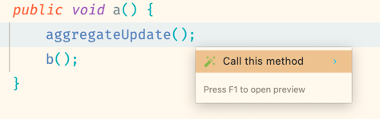
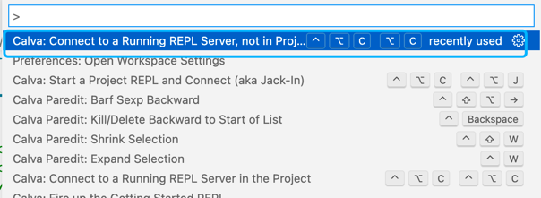
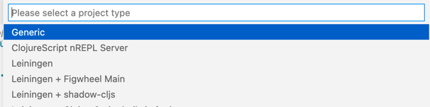

## 无条件调用项目内方法 节约大量开发时间 提高效率 已有IDEA 插件
### 添加依赖
在需要使用的项目中完成下面操作

- maven
直接在项目的`pom.xml`里引入依赖 记得刷新maven
```xml
<dependency>
    <groupId>io.github.schneiderlin</groupId>
    <artifactId>nrepl-starter</artifactId>
    <version>1.0.9</version>
</dependency>
```
- gradle 记得刷新gradle
```groovy
implementation 'io.github.schneiderlin:nrepl-starter:1.0.9'
```
在src/main/resources/application.yml 或者properties文件修改或添加,用以激活application-dev.yml
```yaml
spring: 
  profiles: 
    active: dev
```
然后新增配置 start/src/main/resources/application-dev.yml
```yaml
clojure:
    nrepl:
        state: true
        port: 7888
        mode: dev
```
### 安装 idea 插件
在 https://github.com/schneiderlin/nrepl-starter/releases 中下载最新版本的插件压缩包.
拖动到 idea 中完成安装.

### 使用方式
先启动 spring 项目, 当看到控制台打印出
"Clojure nrepl is started on port(s): 7888" 时.
执行 idea 的 "Start REPL Client" 命令.


鼠标放到想要调用的方法内, command + enter, 选择 Call this method


使用演示视频参考 B 站 https://www.bilibili.com/video/BV1f44y1f7dt/

## 使用 clojure
### prerequisite
本地安装 clojure
https://clojure.org/guides/install_clojure  
安装 vscode, 和 vscode 插件 calva

### vscode 连接项目
启动 spring 项目, PlutusApplication.main.  
启动完成后, 7888 端口会有一个 clojure nrepl 进程在监听.  
在 vscode 使用 calva 插件的 connect to a running REPL server  
  
project type 选择 generic  
  
输入端口号 7888   

